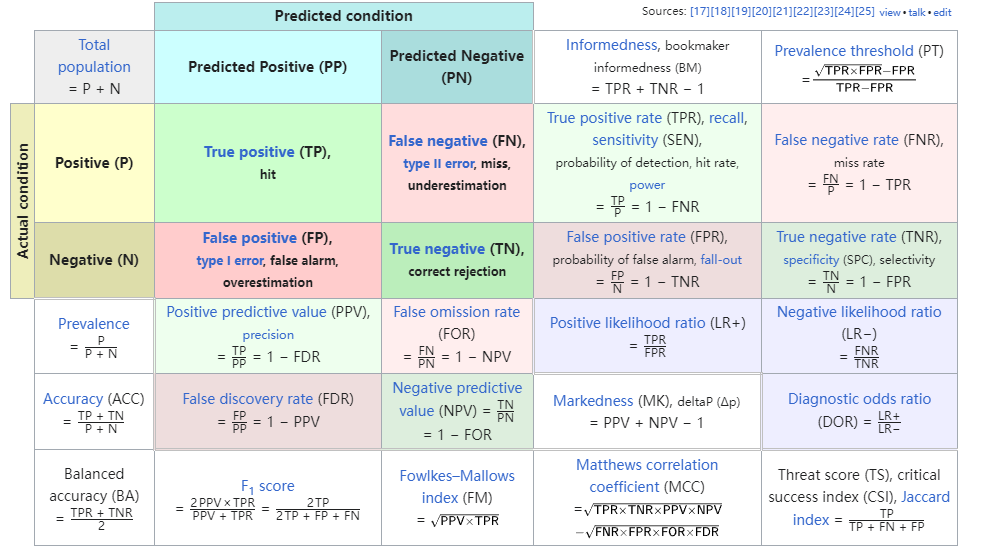

## LLM - Detect AI Generated Text

Description

Can you help build a model to identify which essay was written by middle and high school students, and which was written using a large language model? With the spread of LLMs, many people fear they will replace or alter work that would usually be done by humans. Educators are especially concerned about their impact on students’ skill development, though many remain optimistic that LLMs will ultimately be a useful tool to help students improve their writing skills.

At the forefront of academic concerns about LLMs is their potential to enable plagiarism. LLMs are trained on a massive dataset of text and code, which means that they are able to generate text that is very similar to human-written text. For example, students could use LLMs to generate essays that are not their own, missing crucial learning keystones. Your work on this competition can help identify telltale LLM artifacts and advance the state of the art in LLM text detection. By using texts of moderate length on a variety of subjects and multiple, unknown generative models, we aim to replicate typical detection scenarios and incentivize learning features that generalize across models.

Vanderbilt University, together with ​The Learning Agency Lab, an independent nonprofit based in Arizona, have collaborated with Kaggle on this competition

Evaluation
Submissions are evaluated on area under the ROC curve between the predicted probability and the observed target.

Efficiency Score
We compute a submission's efficiency score by:

$$
\text{Efficiency}=\frac{\text{AUC}}{\text{Benchmark}-\max\text{AUC}} + \frac {\text{RuntimeSeconds}}{ 3 2 4 0 0}
$$
